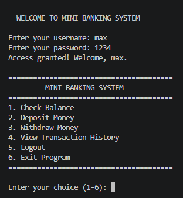
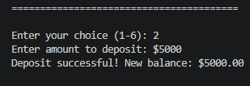
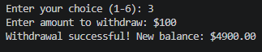
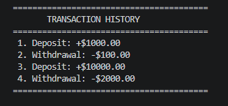

# 🏦 Mini Banking System

A professional **Command-Line Interface (CLI)** banking application developed using **Python 3.13**.

This project simulates a simple banking system where multiple users can securely log in, check their balance, deposit money, withdraw funds, and view transaction history. It was built to practice Python fundamentals, clean code principles, and software design.

---

# 📌 Project Overview

The Mini Banking System is a menu-driven Python application that demonstrates how real-world banking operations can be implemented using core Python concepts.

The project focuses on writing clean, readable, and maintainable code while following good programming practices such as modular design, input validation, exception handling, and documentation.

This project is intended for learning purposes and is part of my Python developer portfolio.

---

# ✨ Features

* 🔐 User Authentication
* 👤 Multiple User Accounts
* 💰 Check Account Balance
* ➕ Deposit Money
* ➖ Withdraw Money
* 📜 Transaction History
* 🔄 Session Management
* ✅ Input Validation
* ⚠️ Exception Handling
* 📝 Type Hinting
* 📚 Function Docstrings
* 🎯 Match-Case Menu
* 🚪 Graceful Exit

---

# 🛠 Technologies Used

| Technology         | Description            |
| ------------------ | ---------------------- |
| Python 3.13        | Programming Language   |
| CLI                | Command-Line Interface |
| Dictionaries       | User Database          |
| Lists              | Transaction Records    |
| Match-Case         | Menu Navigation        |
| Type Hinting       | Better Readability     |
| Exception Handling | Error Management       |

---

# 📂 Project Structure

```text
Mini-Banking-System/
│
├── main.py
├── README.md
├── LICENSE
├── .gitignore
├── requirements.txt
└── screenshots/
```

---

# ⚙️ Requirements

* Python 3.13 or later
* No external libraries required

---

# 🚀 Installation

Clone the repository:

```bash
git clone https://github.com/ariful3551/Mini-Banking-System.git
```

Move into the project folder:

```bash
cd Mini-Banking-System
```

Run the application:

```bash
python main.py
```

---

# 💻 How to Use

1. Start the application.
2. Login using a valid username and password.
3. Choose an option from the menu.
4. Perform banking operations.
5. Logout or exit the program.

---

# 🔑 Default Login Accounts

| Username | Password |
| -------- | -------: |
| max      |     1234 |
| leon     |     1235 |
| jonas    |     1236 |
| felix    |     1237 |

> These accounts are included for demonstration purposes only.

---

# 📸 Screenshots

## 🔑 Login Screen



---

## 💰 Deposit Money



---

## 💸 Withdraw Money



---

## 📜 Transaction History



> **Tip:** Add clear screenshots to make your GitHub repository more attractive and easier to understand.

---

# 📚 Learning Concepts

This project was developed to practice and strengthen the following Python concepts:

### Python Fundamentals

* Variables & Data Types
* User Input & Output
* Type Casting
* Arithmetic Operators
* Comparison Operators
* Conditional Statements
* While Loop
* For Loop
* Functions

### Data Structures

* Lists
* Dictionaries
* Nested Dictionaries
* List Methods (`append()`)

### Intermediate Python

* String Formatting (f-Strings)
* Match-Case Statements
* Type Hinting
* Function Docstrings
* Constants
* Modular Programming

### Software Design

* User Authentication
* Session Management
* Balance Management
* Transaction Tracking
* Menu-Driven Programming
* Input Validation
* Exception Handling
* Program Flow Control

---

# 🌟 Project Highlights

This project demonstrates:

* Clean and readable Python code
* Function-based architecture
* Proper code documentation
* Defensive programming
* Professional naming conventions
* Simple and maintainable project structure
* Beginner-friendly software design

---

# 🚀 Future Improvements

Planned features for upcoming versions:

* JSON data storage
* SQLite database integration
* User registration
* Password hashing
* Money transfer between users
* Interest calculation
* Admin panel
* Logging system
* Object-Oriented Programming (OOP) version
* REST API using FastAPI

---

# 🗺️ Project Roadmap

### ✅ Version 1.0

* User Authentication
* Deposit & Withdraw
* Balance Checking
* Transaction History
* CLI Menu System

### 🔄 Version 2.0

* JSON Database
* Persistent Storage
* Improved Validation

### 🚀 Version 3.0

* SQLite Database
* OOP Architecture
* Advanced Banking Features


---

# 👨‍💻 Author

**Ariful Islam**

Computer Science & Engineering Student

I am passionate about Python, Data Analysis, Machine Learning, and Artificial Intelligence. I enjoy building real-world projects to improve my programming, problem-solving, and software development skills.

**GitHub:** https://github.com/ariful3551

---

# 🤝 Contributing

Contributions, suggestions, and feedback are always welcome.

If you would like to improve this project:

1. Fork the repository.
2. Create a new feature branch.
3. Commit your changes.
4. Push to your branch.
5. Open a Pull Request.

---

# 📄 License

This project is licensed under the **MIT License**.

You are free to use, modify, and distribute this project for educational and personal purposes. See the `LICENSE` file for more details.

---

# 📌 Project Status

**Current Version:** `v1.0.0`

**Status:** ✅ Active

This project is part of my Python learning journey and will continue to evolve with new features and improvements.

---

# ⭐ Support

If you found this project useful, please consider giving it a **⭐ Star** on GitHub.

Your support motivates me to continue learning and building more open-source projects.

---

## 📚 More Projects Coming Soon

I am continuously working on new Python projects, including:

* Scholarship Applicant Evaluation System
* Smart Manufacturing Resource Planning System
* Student Management System
* Inventory Management System
* Data Analysis Projects
* Machine Learning Projects
* AI & LLM Engineering Projects

Stay tuned for more updates!

---

<div align="center">

### Thank you for visiting this repository!

**Happy Coding! 🚀**

Made with ❤️ by **Ariful Islam**

</div>
